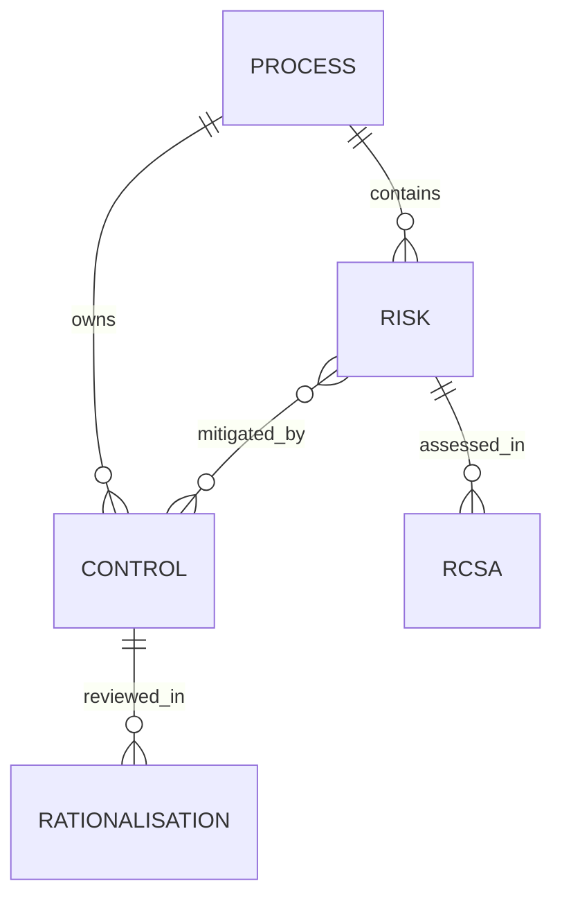

# ControlSphere — Controls Framework & RCSA Workbench

A portfolio prototype for a **fictional** benchmark and market data operation. It demonstrates how a first-line team might connect processes, operational risks, controls, documentation reviews, rationalisation proposals and Risk & Control Self-Assessments (RCSAs). It does not reproduce LSEG / FTSE Russell systems, standards, data or methodology.

## Start

```bash
python -m venv .venv
source .venv/bin/activate  # Windows: .venv\Scripts\activate
pip install -r requirements.txt
streamlit run app.py
```

Open the local address printed by Streamlit. The sample resets on app restart or when you press **Reset demonstration**. Edits are session-local and shared persistence is intentionally absent. Export the audit log before leaving if needed.

## Online deployment configuration

When deploying this repository with Streamlit Community Cloud, use:

| Setting | Value |
| --- | --- |
| Repository | `VivaCrisJ/controlsphere-rcsa-workbench` |
| Branch | `main` |
| Main file | `app.py` |
| Dependencies | `requirements.txt` at repository root |

No secrets or private data are required. Deploy from your own Streamlit account at [share.streamlit.io](https://share.streamlit.io/), then open the generated app URL and check the Overview, Control Library, Rationalisation and RCSA pages. The public demo resets sample changes by session or app restart; do not enter real client evidence.

## What to inspect

1. **Overview** highlights documentation gaps and risks with no active mapped controls.
2. **Process → Risk → Control** links seven fictional processes to 14 risks and 24 curated controls. Risk `R14` has no linked control on purpose.
3. **Control Library** shows an inspectable documentation score, objective, classification and last review. `C08` has a vague activity, no owner, frequency or evidence. Improve the record, explain the change and see the updated score and audit log. A separate lifecycle decision can change a control's status with a written rationale.
4. **Rationalisation** flags identical activity descriptions (`C03` / `C04`, `C09` / `C10`), weak records, a stale inventory review and gaps. A proposed disposition needs a written reason; it never merges or retires controls automatically. Note that `C09` and `C10` have **different risk coverage**, despite identical text.
5. **RCSA Workshop** asks a reviewer to assess residual likelihood and impact with an evidence reference and rationale. `R07` is an example with multiple linked controls. Try rating controls ineffective while claiming low residual exposure to see QA prompts. Above-appetite exposure needs an action and owner. Approval is blocked until prompts are resolved.
6. **Governance & Audit Trail** tracks coverage, submitted assessments, review prompts and changes. Export the local log as JSON.

## Data relationships



Control IDs and risk IDs remain stable during the demo. `risk_ids` is the many-to-many link from a control to the risks it addresses. A process association is kept separately to prevent cross-process linking in the UI. A real implementation would use relational tables, role-based access, approvals and persistent evidence storage.

## Method and limits

- Illustrative risk score = likelihood (1–5) × impact (1–5). The supplied appetite threshold is fictional and risk-specific. Bands: Low 1–4, Medium 5–9, High 10–15, Critical 16–25. RCSA **residual likelihood and impact are entered by a reviewer**; the tool never assumes a precise numeric reduction from control quality.
- Documentation score starts at 100 and deducts 20 for each missing owner, frequency, evidence requirement, risk link or simple vagueness prompt. It is a completeness heuristic, **not a design or operating effectiveness opinion**. Reviewers should inspect actual execution, evidence, precision, exceptions and authority.
- Exact description matches within one process are *potential* duplicates. They require owner review of objectives, risk coverage, timing and evidence before consolidation. The app does not compute statistical similarity or silently apply lifecycle changes.
- RCSA QA prompts are checks for missing rationale/evidence, implausible combinations, control coverage and above-appetite actions. A human must interpret context. Demo approval requires an evidence reference and zero QA prompts; this is not a production sign-off.
- Synthetic records include deliberate weaknesses to make review concrete. No client information or confidential KPMG/LSEG material is used. The local log has no login, durable storage or tamper resistance.

## Portfolio positioning

This is an **independent prototype**, not professional ownership of a production first-line RCSA programme or experience with MetricStream. It complements [RiskFlow](https://github.com/VivaCrisJ/riskflow-issue-management), which focuses on issues, remediation and closure. ControlSphere demonstrates the upstream control inventory, mapping and assessment workflow.

## Checks

Run the standard-library domain checks without installing application dependencies:

```bash
python -m unittest discover -s tests -v
python -m compileall -q app.py domain.py sample_data.py
```

The app requires Python 3.10+ and Streamlit and pandas as listed in `requirements.txt`.
